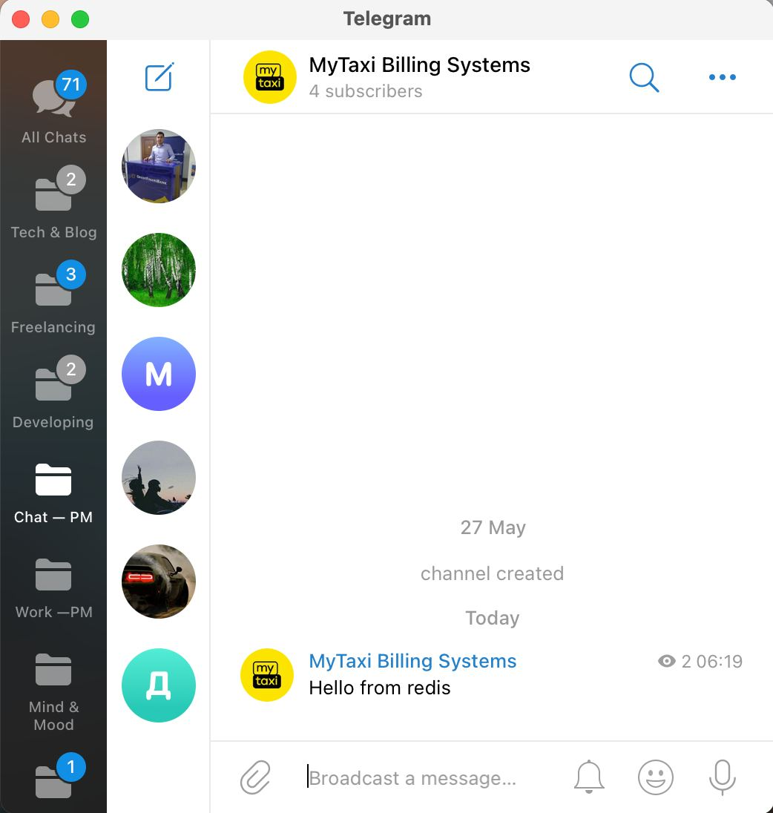

# Redis-Telebot v1 
Sourcode and Resources for Telegram and Redis Integration v1

 

# Installation
* 1 - clone repo https://github.com/Muhammadali-Akbarov/redis-telebot.git
* 2 - create a virtual environment and activate
*  - pip3 install virtualenv
*  - virtualenv venv
*  - source venv/bin/activate
* 3 - cd into project "cd redis-telebot"
* 4 - pip3 install -r requirements.txt
* 5 - python3 main.py

# Features
* 1 - redis-cli
* 2 - SUBSCRIBE mychannel
* 3 - PUBLISH telegram_notifications '{"chat_id": "any chat id if bot connected as admin or has private chat", "message": "Hello from redis"}'

